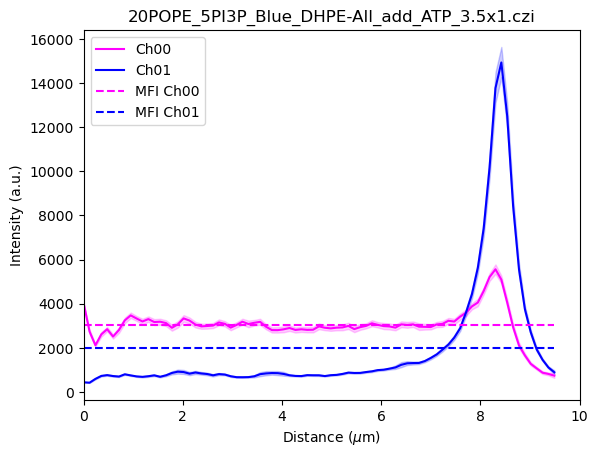

# Measure radial intensity
Measurement and batch plot of radial intensity of circular structure in multichannel images.

This repository contains the code used the analyze the data in the following preprint

[Mechanistic studies of autophagic cargo recruitment and membrane expansion through in vitro reconstitution](https://www.biorxiv.org/content/10.1101/2024.12.24.630225v1.full)
 Wenxin Zhang, Thomas Litschel, Rocco D’Antuono, Colin Davis, Anne Schreiber, Sharon A. Tooze
[https://www.biorxiv.org/content/10.1101/2024.12.24.630225v1.full](https://www.biorxiv.org/content/10.1101/2024.12.24.630225v1.full)

## ImageJ macro - Measurement
The ImageJ macro identify circular structures in the field of view and generates radial lines that are used to obtain intensity measurements.

|  |  |
| -----|  ----|
| Radial measurement of Ch 01 | Radial measurement of Ch 01|

## Jupyter notebook - Plot
The Jupyter notebook code concatenates multiple .csv files containing the radial intensity measurements, and plot the average with confidence interval.

|     |
| -----|
| Radial measurement of Ch00 and Ch01 |
